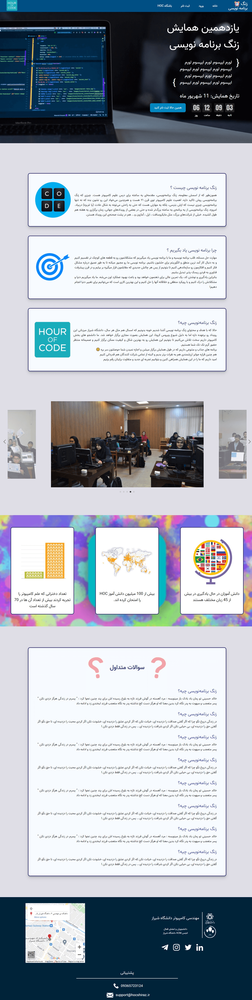
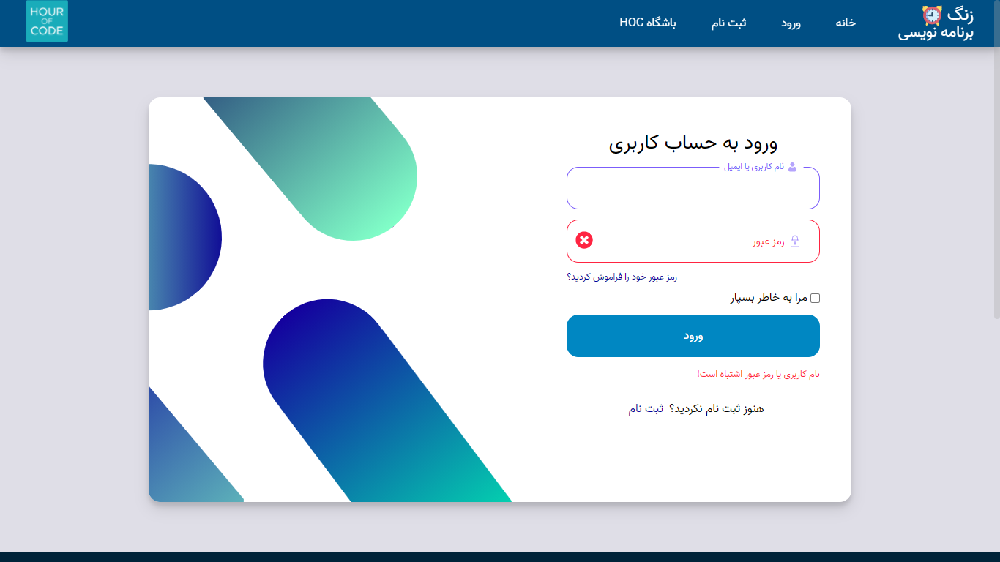
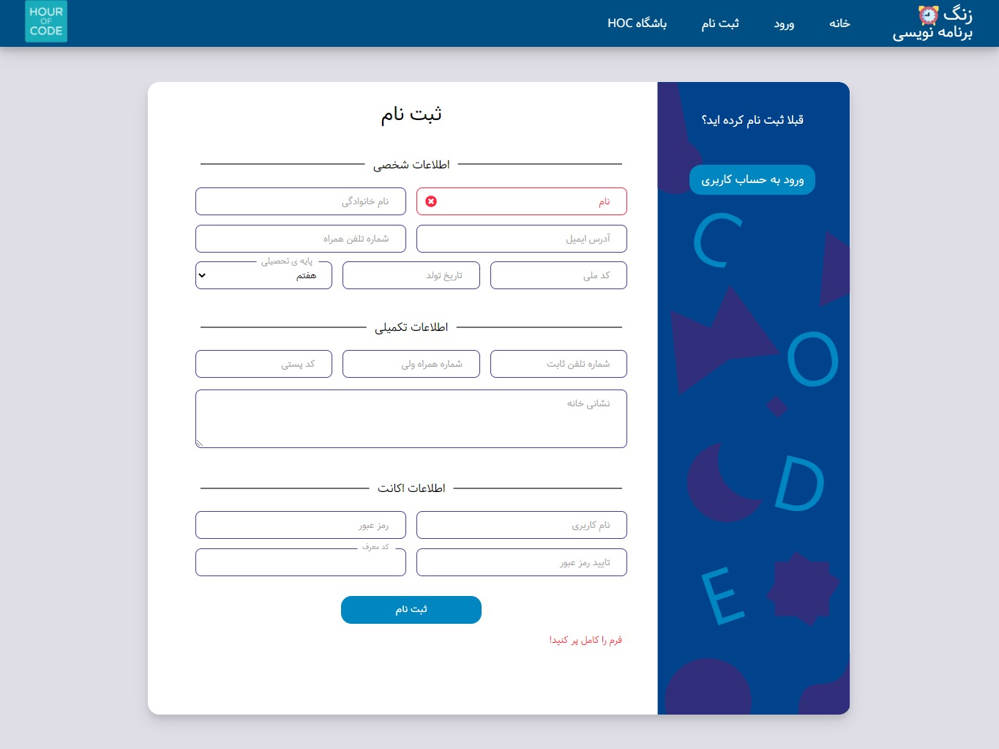

<h1 dir="rtl">فرانت سایت همایش برنامه نویسی HOC</h1>

------

    
فرانت سایت همایش جهانی برنامه نویسی HOC که توسط دانشجویان دانشگاه شیراز برگزار میشود

    
طراحی شده توسط <a href="https://github.com/AmirHosein-Gharaati">امیرحسین قرائتی</a>

    <h3>صفحه ی اصلی:</h3>
    
        <figure class="post-figure">
            
        </figure>
    
    <h3>صفحه ی ورود:</h3>
    
        <figure class="post-figure">
            
        </figure>
    
    <h3>صفحه ی ثبت نام:</h3>
    
        <figure class="post-figure">
            
        </figure>
    

